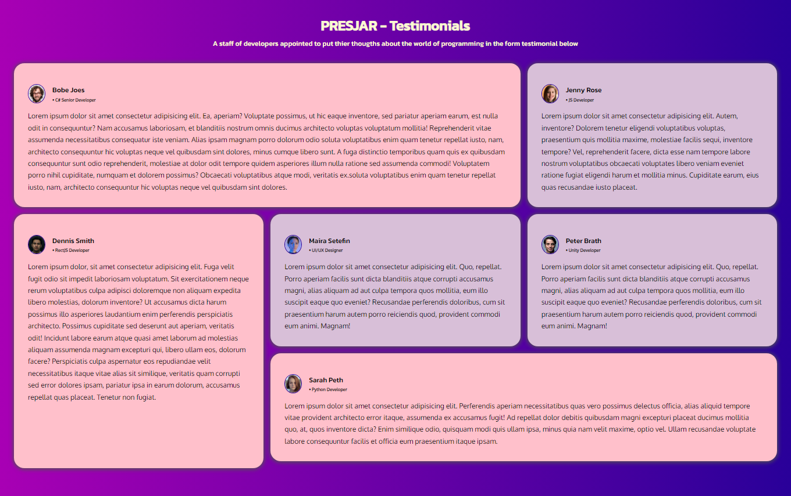

# PRESJAR - Programmers Testimonial Jar





## Installation

1. Download Npm [https://nodejs.org/en/download]
2. Install Live sass compiler in VS code & run 

```bash
  npm install -g sass
```
```bash
  sass --watch style.scss min/style.min.css
```

    
## Documentation

[Sass setup](https://sass-lang.com/install/)

[Sass Documentation](https://sass-lang.com/documentation/)

## Color Reference

https://www.w3schools.com/cssref/css_colors.php

## Feedback

If you have any feedback, please reach out to us at https://www.instagram.com/colibzo/

